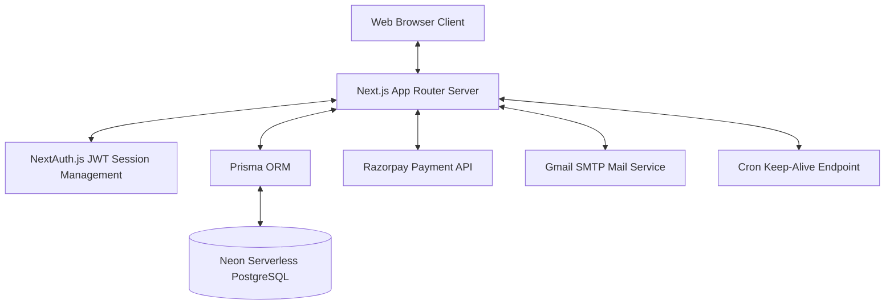
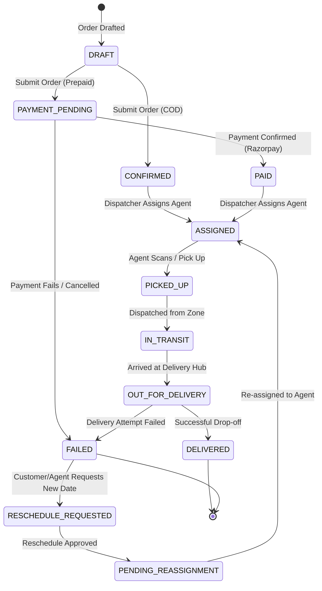

# Last-Mile Delivery Tracker

A modern, hyper-local logistics orchestration engine and real-time tracking platform. Built for B2B/B2C operations, this platform handles dynamic zone-based pricing, automatic and manual dispatching, real-time agent tracking, and multi-role operations.

---

## 🌟 Key Features

### 👤 Multi-Role Architecture
* **Customer Portal**: Book deliveries (B2B/B2C, intra-zone/inter-zone, or international), view dynamic price estimates, pay securely via Razorpay, and track active shipments.
* **Delivery Agent Web-Console**: Update active delivery states (Picked Up, Out for Delivery, Delivered, Failed), provide location updates, and manage daily task logs.
* **Manager Workspace**: Dispatch pending assignments, view dispatch queues, approve rescheduling requests, and monitor agent workloads.
* **Admin Dashboard**: Control center to approve new accounts, manage zone layouts, edit pricing cards, and monitor system revenue/analytics.

### ⚡ Technical Details
* **Automated Zone-Based Pricing**: Pricing is calculated on-the-fly using parcel dimensions (volumetric weight vs actual weight), delivery distance (intra-zone/inter-zone/international), and payment type surcharges.
* **Real-time Status Timelines**: Seamless updates with status logs recording every phase of the delivery from order placement to final verification.
* **Keep-Warm Mechanism**: Built-in ping service prevents serverless function and serverless database scaling timeouts (cold starts).

---

## ⚙️ Architecture & Technical Stack



### Stack
* **Framework**: Next.js (App Router, Server Actions, API Routes)
* **Language**: TypeScript
* **Database**: PostgreSQL (Neon Serverless)
* **Database Client**: Prisma ORM
* **Authentication**: NextAuth.js (Credentials & Google OAuth Provider)
* **Styling**: TailwindCSS & CSS Variables
* **Testing**: Vitest

---

## 🔄 Order Lifecycle & Workflow State Machine

The following diagram illustrates how orders transition through different states in the logistics pipeline:



---

## 🔑 Tester Accounts & Credentials

To facilitate evaluation, the database contains pre-configured test credentials for each user role. 

> [!NOTE]
> Run the database seed script (`npm run db:seed`) to populate these test accounts in your database instance.

| Role | Email | Password | Purpose |
| :--- | :--- | :--- | :--- |
| **Admin** | `admin@lastmile.test` | `Admin@12345` | Manage system-wide rates, zones, and approve registration requests. |
| **Manager** | `manager@lastmile.test` | `Manager@12345` | Assign orders to delivery agents, approve reschedules, and check metrics. |
| **Agent (Delhi)** | `agent.delhi@lastmile.test` | `Agent@12345` | Test the delivery agent flow (update status to PICKED_UP, DELIVERED, etc.). |
| **Agent (Mumbai)**| `agent.mumbai@lastmile.test`| `Agent@12345` | Alternate agent profile for geo-location simulation. |
| **Customer 1** | `customer@lastmile.test` | `Customer@12345` | Standard customer profile to create new orders, pay, and view history. |
| **Customer 2** | `customer.two@lastmile.test` | `Customer@12345` | Secondary customer profile. |

---

## 🛠️ Local Development & Setup

Follow these steps to set up and run the application locally:

### 1. Prerequisites
Ensure you have Node.js (v18 or higher) and npm installed.

### 2. Install Dependencies
Clone the repository and run:
```bash
npm install
```

### 3. Environment Setup
Create a `.env` file in the root of the project. You can copy the template from `.env.example`:
```bash
cp .env.example .env
```
Fill in the configuration details inside `.env` (database link, NextAuth secrets, SMTP email credentials, and Razorpay API keys).

### 4. Database Setup (Migrations & Seeding)
Sync the schema with your database and run the seeder script to populate cities, zones, rate cards, and test accounts:
```bash
# Generate Prisma Client
npx prisma generate

# Run migrations to build the tables
npx prisma migrate dev --name init

# Run seed script
npm run db:seed
```

### 5. Start the Development Server
Launch the local server:
```bash
npm run dev
```
Open [http://localhost:3000](http://localhost:3000) in your browser to view the application.

---

## 🧪 Testing

Unit tests for calculation models, billing logic, and address resolution rules are written using **Vitest**. To execute tests, run:
```bash
npm run test
```
