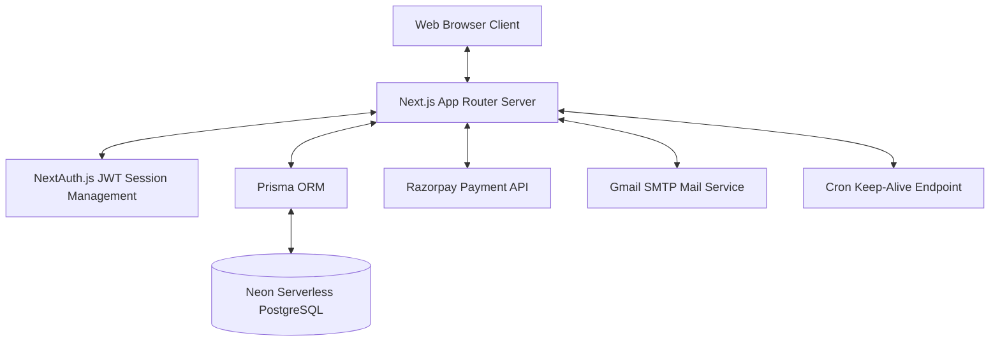
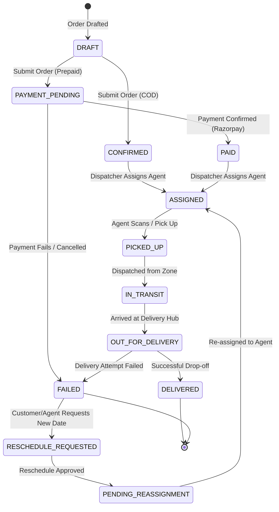

# Last-Mile Delivery Tracker

A modern, hyper-local logistics orchestration engine and real-time tracking platform. Built for B2B/B2C operations, this platform handles dynamic zone-based pricing, automatic and manual dispatching, real-time agent tracking, and multi-role operations.

---

## 🌟 Application Features

The Last-Mile Delivery Tracker comes with a comprehensive suite of enterprise-grade logistics features:

### 1. Proximity-Based Auto-Assignment Engine
* **Haversine Distance Matching**: The auto-assignment algorithm calculates the great-circle distance between the parcel's pickup coordinate and every active `AVAILABLE` delivery agent's last known GPS coordinate.
* **Fallback Routing for New Cities**: If an order is booked in an unserviced location (e.g. Kanpur is not added as a custom zone), the engine queries all available agents across the country and automatically assigns the order to the **geographically nearest agent/station**.
* **Workload-Aware Load Balancing**: Prevents overloading by taking active order counts into account when assigning new deliveries.

### 2. Dynamic Pricing Engine
* **Volumetric vs Actual Weight**: Automatically calculates pricing using either actual weight or volumetric weight (length × breadth × height / 5000), whichever is higher.
* **Route Classification**: Classifies orders into Intra-Zone, Inter-Zone, or International, applying distinct rate cards automatically.
* **COD Surcharges**: Applies custom surcharges for Cash on Delivery orders to cover handling costs.

### 3. Multi-Role Operational Consoles
* **Customer Portal**: Book orders, view dynamic price sheets, track package history, and pay via payment gateway.
* **Manager Dispatch Hub**: Manage the global queue, view active agent distribution, approve rescheduling requests, and trigger auto-assignment.
* **Field Agent App**: View assigned deliveries, update transit logs (Picked Up, In Transit, Out for Delivery, Delivered, Failed), and update current GPS location.
* **Admin Control Center**: Approve registration requests, manage international and domestic rate cards, configure zone coordinates, and review revenue analytics.

### 4. Integration & Infrastructure
* **Razorpay Payment Gateway**: Fully integrated sandbox payment flow for prepaid orders.
* **Email & SMS Notifications**: Integrated notification service to update customers about delivery events.
* **Warm-up Daemon**: Built-in `/api/ping` endpoint paired with a cron job to keep the serverless database (Neon) and lambda environments active, preventing cold start delays.

---

## ⚙️ Architecture & Technical Stack



### Stack
* **Framework**: Next.js (App Router, Server Actions, API Routes)
* **Language**: TypeScript
* **Database**: PostgreSQL (Neon Serverless)
* **Database Client**: Prisma ORM
* **Authentication**: NextAuth.js (Credentials & Google OAuth Provider)
* **Styling**: TailwindCSS & CSS Variables
* **Testing**: Vitest

---

## 🔄 Order Lifecycle & Workflow State Machine

The following diagram illustrates how orders transition through different states in the logistics pipeline:



---

## 🔑 Tester Accounts & Credentials

### Core Roles
| Role | Email | Password | Purpose |
| :--- | :--- | :--- | :--- |
| **Admin** | `admin@lastmile.test` | `Admin@12345` | Manage system-wide rates, zones, and approve registration requests. |
| **Manager** | `manager@lastmile.test` | `Manager@12345` | Assign orders to delivery agents, approve reschedules, and check metrics. |
| **Customer** | `customer@lastmile.test` | `Customer@12345` | Standard customer profile to create new orders, pay, and view history. |
| **Customer 2** | `customer.two@lastmile.test` | `Customer@12345` | Secondary customer profile. |

### 📍 50 Indian Cities Agent Accounts
Each city is pre-seeded with a dedicated delivery agent/station.
* **Password for all Agent accounts**: `Agent@12345`
* **Email format**: `agent.<cityname_lowercase>@lastmile.test`

| City | Agent Email | Coordinates (Lat, Lng) |
| :--- | :--- | :--- |
| **Mumbai** | `agent.mumbai@lastmile.test` | `19.0760, 72.8777` |
| **Delhi** | `agent.delhi@lastmile.test` | `28.6139, 77.2090` |
| **Bengaluru** | `agent.bengaluru@lastmile.test` | `12.9716, 77.5946` |
| **Hyderabad** | `agent.hyderabad@lastmile.test` | `17.3850, 78.4867` |
| **Ahmedabad** | `agent.ahmedabad@lastmile.test` | `23.0225, 72.5714` |
| **Chennai** | `agent.chennai@lastmile.test` | `13.0827, 80.2707` |
| **Kolkata** | `agent.kolkata@lastmile.test` | `22.5726, 88.3639` |
| **Surat** | `agent.surat@lastmile.test` | `21.1702, 72.8311` |
| **Pune** | `agent.pune@lastmile.test` | `18.5204, 73.8567` |
| **Jaipur** | `agent.jaipur@lastmile.test` | `26.9124, 75.7873` |
| **Lucknow** | `agent.lucknow@lastmile.test` | `26.8467, 80.9462` |
| **Kanpur** | `agent.kanpur@lastmile.test` | `26.4499, 80.3319` |
| **Nagpur** | `agent.nagpur@lastmile.test` | `21.1458, 79.0882` |
| **Indore** | `agent.indore@lastmile.test` | `22.7196, 75.8577` |
| **Thane** | `agent.thane@lastmile.test` | `19.2183, 72.9781` |
| **Bhopal** | `agent.bhopal@lastmile.test` | `23.2599, 77.4126` |
| **Visakhapatnam** | `agent.visakhapatnam@lastmile.test` | `17.6868, 83.2185` |
| **Patna** | `agent.patna@lastmile.test` | `25.5941, 85.1376` |
| **Vadodara** | `agent.vadodara@lastmile.test` | `22.3072, 73.1812` |
| **Ghaziabad** | `agent.ghaziabad@lastmile.test` | `28.6692, 77.4538` |
| **Ludhiana** | `agent.ludhiana@lastmile.test` | `30.9010, 75.8573` |
| **Agra** | `agent.agra@lastmile.test` | `27.1767, 78.0081` |
| **Nashik** | `agent.nashik@lastmile.test` | `19.9975, 73.7898` |
| **Faridabad** | `agent.faridabad@lastmile.test` | `28.4089, 77.3178` |
| **Meerut** | `agent.meerut@lastmile.test` | `28.9845, 77.7064` |
| **Rajkot** | `agent.rajkot@lastmile.test` | `22.3039, 70.8022` |
| **Kalyan-Dombivli**| `agent.kalyandombivli@lastmile.test`| `19.2354, 73.1291` |
| **Vasai-Virar** | `agent.vasaivirar@lastmile.test` | `19.3919, 72.8397` |
| **Varanasi** | `agent.varanasi@lastmile.test` | `25.3176, 82.9739` |
| **Srinagar** | `agent.srinagar@lastmile.test` | `34.0837, 74.7973` |
| **Aurangabad** | `agent.aurangabad@lastmile.test` | `19.8762, 75.3433` |
| **Dhanbad** | `agent.dhanbad@lastmile.test` | `23.7957, 86.4304` |
| **Amritsar** | `agent.amritsar@lastmile.test` | `31.6340, 74.8723` |
| **Navi Mumbai** | `agent.navimumbai@lastmile.test` | `19.0330, 73.0297` |
| **Prayagraj** | `agent.prayagraj@lastmile.test` | `25.4358, 81.8463` |
| **Howrah** | `agent.howrah@lastmile.test` | `22.5958, 88.2636` |
| **Gwalior** | `agent.gwalior@lastmile.test` | `26.2183, 78.1828` |
| **Jabalpur** | `agent.jabalpur@lastmile.test` | `22.1702, 79.9322` |
| **Coimbatore** | `agent.coimbatore@lastmile.test` | `11.0168, 76.9558` |
| **Vijayawada** | `agent.vijayawada@lastmile.test` | `16.5062, 80.6480` |
| **Jodhpur** | `agent.jodhpur@lastmile.test` | `26.2389, 73.0243` |
| **Madurai** | `agent.madurai@lastmile.test` | `9.9252, 78.1198` |
| **Raipur** | `agent.raipur@lastmile.test` | `21.2514, 81.6296` |
| **Kota** | `agent.kota@lastmile.test` | `25.2138, 75.8648` |
| **Guwahati** | `agent.guwahati@lastmile.test` | `26.1158, 91.7086` |
| **Chandigarh** | `agent.chandigarh@lastmile.test` | `30.7333, 76.7794` |
| **Solapur** | `agent.solapur@lastmile.test` | `17.6599, 75.9064` |
| **Hubli-Dharwad** | `agent.hublidharwad@lastmile.test`| `15.3647, 75.1240` |
| **Bareilly** | `agent.bareilly@lastmile.test` | `28.3640, 78.4126` |
| **Mysore** | `agent.mysore@lastmile.test` | `12.2958, 76.6394` |

---

## 🛠️ Local Development & Setup

Follow these steps to set up and run the application locally:

### 1. Prerequisites
Ensure you have Node.js (v18 or higher) and npm installed.

### 2. Install Dependencies
Clone the repository and run:
```bash
npm install
```

### 3. Environment Setup
Create a `.env` file in the root of the project. You can copy the template from `.env.example`:
```bash
cp .env.example .env
```
Fill in the configuration details inside `.env`.

### 4. Database Setup (Migrations & Seeding)
Sync the schema with your database and run the seeder script to populate cities, zones, rate cards, and test accounts:
```bash
# Generate Prisma Client
npx prisma generate

# Run migrations to build the tables
npx prisma migrate dev --name init

# Run seed script
npm run db:seed
```

### 5. Start the Development Server
Launch the local server:
```bash
npm run dev
```
Open [http://localhost:3000](http://localhost:3000) in your browser to view the application.

---

## 🧪 Testing

Unit tests for calculation models, billing logic, and address resolution rules are written using **Vitest**. To execute tests, run:
```bash
npm run test
```
